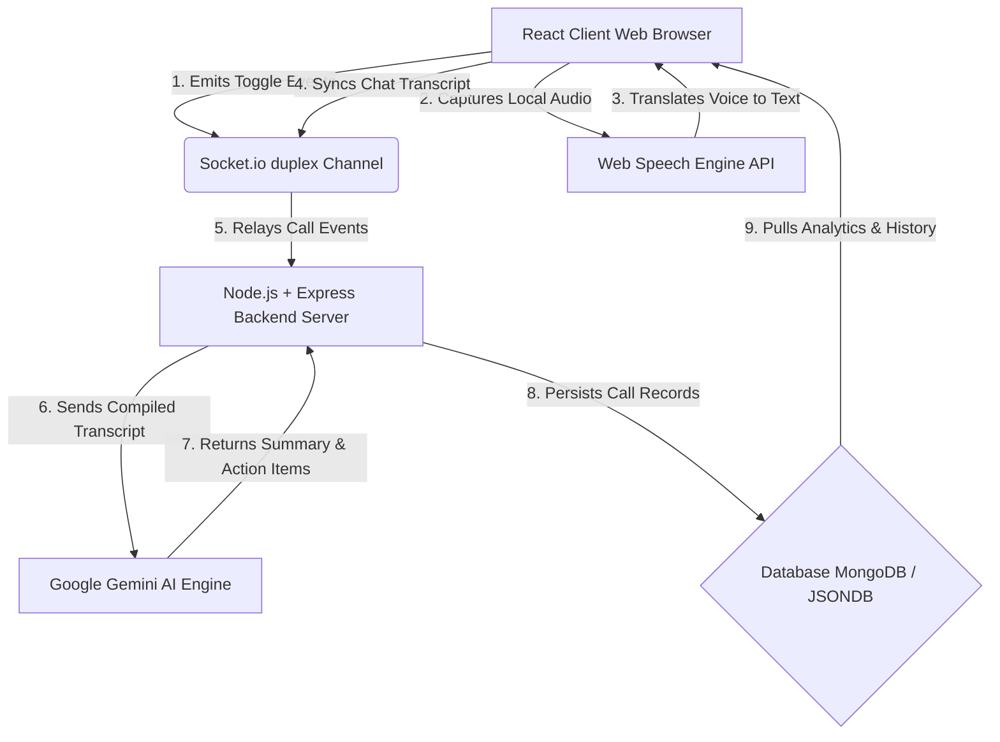

# AI MEETING INTELLIGENCE SYSTEM

A Minor Project Report submitted in partial fulfillment of the requirements for the award of the degree of
### Bachelor of Technology
In
### Computer Science & Engineering

---

## 🏢 PAGE 1: TITLE PAGE

**PROJECT TITLE:** AI MEETING INTELLIGENCE SYSTEM  
**A Dissertation Submitted In Partial Fulfillment of the Requirements for the Award of the Degree of**  
**Bachelor of Technology**  
**In**  
**Computer Science & Engineering**  

### Submitted To:
**RAJIV GANDHI PROUDYOGIKI VISHWAVIDYALAYA**  
**BHOPAL (M.P.)**  

```
        ==================================================
                 IES COLLEGE OF TECHNOLOGY LOGO
        ==================================================
```

### Submitted By:
* **Akshita Mourya** (Enrollment No: `0177CS231001`) *(Team Leader)*
* **[Member Name 2]** (Enrollment No: `0177CS2310XX`)
* **[Member Name 3]** (Enrollment No: `0177CS2310XX`)
* **[Member Name 4]** (Enrollment No: `0177CS2310XX`)

### Under the Supervision of:
**Mrs. Aishwarya Mishra**  
*(Assistant Professor, Department of CSE)*

### Departmental Heads:
* **Dr. Nikhat Raza Khan** *(H.O.D., Dept of CSE)*
* **Dr. G. K. Pandey** *(Principal, IES College of Technology)*

**IES COLLEGE OF TECHNOLOGY, BHOPAL (M.P.)**  
**Academic Session: 2026-2027**  

---

## 📜 PAGE 2: CERTIFICATE

### DEPARTMENT OF COMPUTER SCIENCE & ENGINEERING
### IES COLLEGE OF TECHNOLOGY, BHOPAL (M.P.)

```
        ==================================================
                 IES COLLEGE OF TECHNOLOGY LOGO
        ==================================================
```

### CERTIFICATE

This is to certify that the work embodied in this Minor Project entitled **"AI MEETING INTELLIGENCE SYSTEM"** being submitted by:
* **Akshita Mourya** (Enrollment No: `0177CS231001`)
* **[Member Name 2]** (Enrollment No: `0177CS2310XX`)
* **[Member Name 3]** (Enrollment No: `0177CS2310XX`)
* **[Member Name 4]** (Enrollment No: `0177CS2310XX`)

for partial fulfillment of the requirements for the award of **Bachelor of Technology in Computer Science & Engineering** to **Rajiv Gandhi Proudyogiki Vishwavidyalaya, Bhopal (M.P.)** during the academic year 2026-2027 is a record of bonafide piece of work, carried out by them under my supervision and guidance in **IES College of Technology, Bhopal (M.P.)**.

<br><br><br>

**Mrs. Aishwarya Mishra**  
*(Project Guide)*  

**Dr. Nikhat Raza Khan**  
*(H.O.D., Dept of CSE)*  

**Dr. G. K. Pandey**  
*(Principal, IES College)*  

---

## 📜 PAGE 3: APPROVAL CERTIFICATE

### DEPARTMENT OF COMPUTER SCIENCE & ENGINEERING
### IES COLLEGE OF TECHNOLOGY, BHOPAL (M.P.)

```
        ==================================================
                 IES COLLEGE OF TECHNOLOGY LOGO
        ==================================================
```

### APPROVAL CERTIFICATE

The Minor Project entitled **"AI MEETING INTELLIGENCE SYSTEM"** being submitted by **Akshita Mourya, [Member 2], [Member 3], and [Member 4]** has been examined by us and is hereby approved for the award of the degree **Bachelor of Technology in Computer Science & Engineering**, for which it has been submitted. It is understood that by this approval the undersigned do not necessarily endorse or approve any statement made, opinion expressed, or conclusion drawn therein, but approve the dissertation only for the purpose for which it has been submitted.

<br><br><br>

**(Internal Examiner)**  
*Date:*  

**(External Examiner)**  
*Date:*  

---

## 📜 PAGE 4: DECLARATION

### DEPARTMENT OF COMPUTER SCIENCE & ENGINEERING
### IES COLLEGE OF TECHNOLOGY, BHOPAL (M.P.)

```
        ==================================================
                 IES COLLEGE OF TECHNOLOGY LOGO
        ==================================================
```

### DECLARATION

I hereby declare that the work, which is being presented in the Minor Project, entitled **"AI Meeting Intelligence System"** in partial fulfillment of the requirements for the award of the degree of **Bachelor of Technology in Computer Science & Engineering** branch, submitted in the department of **IES College of Technology, Bhopal** is an authentic record of my own work carried under the guidance of **Mrs. Aishwarya Mishra**. I have not submitted the matter embodied in this report for the award of any other degree elsewhere.

<br><br><br>

**Akshita Mourya** (Enrollment No: `0177CS231001`)  
**[Member Name 2]** (Enrollment No: `0177CS2310XX`)  
**[Member Name 3]** (Enrollment No: `0177CS2310XX`)  
**[Member Name 4]** (Enrollment No: `0177CS2310XX`)  

---

## 📜 PAGE 5: ACKNOWLEDGEMENT

### ACKNOWLEDGEMENT

We are deeply indebted to our Principal **Dr. G. K. Pandey**, who modeled us both technically and morally for achieving greater success in life. He showed us different ways to approach a research problem and the need to be persistent to accomplish any goal. We thank him heartily.

We express our deepest gratitude to our H.O.D. **Dr. Nikhat Raza Khan** for providing us with a highly supportive and advanced academic environment to complete our project successfully.

We are very grateful to our Project Guide **Mrs. Aishwarya Mishra** for being highly instrumental in the completion of our project, providing constant direction, critical reviews, and supervision.

We also thank all the staff members of our college and technicians for their timely support in making this project a successful one.

<br><br><br>

**Akshita Mourya** (Enrollment No: `0177CS231001`)  
**[Member Name 2]** (Enrollment No: `0177CS2310XX`)  
**[Member Name 3]** (Enrollment No: `0177CS2310XX`)  
**[Member Name 4]** (Enrollment No: `0177CS2310XX`)  

---

## 📜 PAGE 6: ABSTRACT

### ABSTRACT

The purpose of the **AI Meeting Intelligence System** is to provide a complete, low-latency, and highly productive meeting workspace. With remote and hybrid work becoming the standard, standard video calls suffer from issues like side conversations, poor structure, and task accountability tracking gaps. This project addresses these limitations by embedding real-time artificial intelligence directly into the browser video meeting.

The system features:
1. **Smart Agenda Generator**: Utilizes natural language processing to create a custom chronological schedule based on the user's meeting goal and length.
2. **Real-time Speech-to-Text**: Logs call transcripts dynamically using HTML5 Speech Recognition.
3. **Multi-lingual Translation**: Instantly translates spoken text to target languages (such as Hindi, Spanish, or French).
4. **AI Meeting Summarizer & Action Items**: Calls the Google Gemini NLP engine upon call termination to compile decision bullet points and auto-assign task checklists.
5. **Engagement Analytics**: Monitors camera/microphone toggles and speaking distribution to score meeting quality.

The project is built on a modern stack including **React.js (Vite)** on the frontend, **Node.js & Express.js** on the backend, **Socket.io** for real-time duplex data syncing, and **MongoDB** (with local JSONDB self-healing fallbacks) for data persistence.

**Project Link:** [https://online-meet-two.vercel.app/](https://online-meet-two.vercel.app/)

---

## 📜 PAGE 7: TABLE OF CONTENTS

| S. No. | Description | Page No. |
| :--- | :--- | :--- |
| **1** | **Chapter 1: Introduction** | **08** |
| | 1.1 Problem Statement | 08 |
| | 1.2 Solution & Objectives | 09 |
| | 1.3 Technology Stack Used | 09 |
| | 1.4 System Requirements | 10 |
| **2** | **Chapter 2: Diagrams** | **11** |
| | 2.1 Use Case Diagram | 11 |
| | 2.2 System Architecture Workflow Diagram | 11 |
| **3** | **Chapter 3: Source Code** | **12** |
| | 3.1 Frontend App React Setup | 12 |
| | 3.2 Real-time Dashboard state logic | 14 |
| **4** | **Chapter 4: Prototype Screenshots** | **16** |
| | 4.1 Interface Layouts Overview | 16 |
| **5** | **Chapter 5: Project Limitations** | **19** |
| **6** | **Chapter 6: Conclusion and Future Scope** | **20** |
| | 6.1 Conclusion | 20 |
| | 6.2 Future Scope | 20 |

---

## 📜 PAGE 8: CHAPTER 1 - INTRODUCTION

## Chapter 1: Introduction

### 1.1 Problem Statement
Modern corporate and academic workflows are heavily reliant on remote video communication platforms. However, standard meeting tools (like basic Zoom or Google Meet calls) operate merely as audio-visual channels, lacking built-in tools to capture, organize, and track the intellectual capital generated during calls. This results in several core inefficiencies:
1. **Meeting Disorganization**: Calls regularly drift off-topic because there is no structured agenda integrated directly into the meeting interface.
2. **Loss of Critical Details**: Important metrics, dates, and announcements shared verbally are forgotten. Research indicates that participants forget up to 80% of meeting details within 24 hours of call completion.
3. **Ineffective Action-Item Tracking**: Tasks and deadlines assigned verbally are rarely logged systematically, leading to missed deliverables and project bottlenecks.
4. **Manual Documentation Overhead**: Documenting minutes of meetings (MoM) manually is tedious, prone to human error, and demands valuable engineering hours after calls.
5. **Language & Communication Barriers**: Multi-lingual teams struggle to collaborate due to a lack of low-latency, speech-integrated translation systems.

---

## 📜 PAGE 9: CHAPTER 1 - INTRODUCTION (CONTINUED)

### 1.2 The Solution & Project Objectives
The **AI Meeting Intelligence System** is engineered to eliminate these bottlenecks by turning video calls into structured, action-oriented, and self-documenting workspaces. The core objectives of the project are:
* **Pre-Meeting Structuring**: Providing an AI-driven tool that analyzes meeting goals and structures time-blocked agendas.
* **Real-time Transcription & Translation**: Integrating HTML5 Speech-to-Text and translation APIs directly into the P2P connection grid, enabling real-time captions and multi-lingual accessibility (such as translating English audio to Hindi text).
* **Automated Documentation**: Running natural language processing algorithms (via the Gemini API) upon call completion to auto-generate bulleted summaries and checklist deliverables.
* **Accountability Boards**: Creating a central task dashboard where action items are assigned, tracked, and completed.
* **Engagement Evaluation**: Logging participant camera/microphone toggles and active speaking share percentages to score overall call efficiency.

### 1.3 Technology Stack Used
* **Frontend UI Layer**: Built using **Vite + React.js**, providing a fast, component-driven reactive single-page application. Styled with modern custom CSS and Lucide React icons.
* **Web APIs**: Integrated the browser-native **Web Speech API** for speech-to-text translation and canvas APIs for custom peer stream layouts.
* **Backend Server Layer**: Programmed on **Node.js** with **Express.js**, running event-driven loops.
* **Real-time Sync Channel**: Integrated **Socket.io** to enable full-duplex communication channels for instant screen updates, mic toggles, and chat messages.
* **AI NLP Processor**: Connected to the **Google Gemini Developer API** for context parsing and natural language summarization.
* **Database Persistence Layer**: Programmed with **MongoDB + Mongoose ODM** for cloud storage, backed by a custom-coded local JSON database fallback for zero-downtime offline execution.

---

## 📜 PAGE 10: CHAPTER 1 - INTRODUCTION (SYSTEM REQUIREMENTS)

### 1.4 System Requirements

#### Recommended System Requirements for Development (Vite + Node.js environment)
* **Operating System**: Windows 10/11 (64-bit) or macOS (10.15 or higher).
* **RAM**: 8 GB RAM minimum (16 GB recommended for running concurrent server environments).
* **Software Development Kits**: Node.js LTS version (v18.0 or higher), NPM (v9.0 or higher).
* **IDE**: Visual Studio Code with ESLint and React Developer Tools extensions.
* **Database**: MongoDB Community Edition (v6.0 or higher) or MongoDB Atlas Cloud instance.
* **API Credentials**: Active Google Gemini API Developer Key.

#### Recommended System Requirements to Run the App (Production Deployment)
* **Hosting Environment**: Vercel (Frontend Client) and Render/Heroku (Backend Web Service).
* **Client Browser**: Google Chrome (v85+) or Microsoft Edge (v85+) – required for browser-native Web Speech API compatibility.
* **Hardware Requirements**: Intel Core i3 or higher (or equivalent Apple Silicon), 4 GB RAM, microphone and camera peripherals.
* **Network Speed**: Minimum 2 Mbps stable upload/download bandwidth for WebRTC and Socket syncing.

---

## 📜 PAGE 11: CHAPTER 2 - DIAGRAMS

## Chapter 2: Diagrams

### 2.1 Use Case Diagram
The following table outlines the system use cases and actor interactions:

| Actor | Action / Use Case | Description |
| :--- | :--- | :--- |
| **User (Host / Participant)** | Register & Login | Create accounts securely using JWT-based credentials. |
| **User (Host)** | Generate Smart Agenda | Enter meeting goals and duration to get an AI-compiled checklist. |
| **User (Host / Participant)** | Join Call Room | Enter native room code to connect video/audio feeds via WebSockets. |
| **User (Participant)** | Speak & Chat | Talk in call; local speech recognition parses speech to text. |
| **AI NLP Engine (Gemini)** | Summarize & Extract Tasks | Analyzes transcript upon call end, creating bullet points and task grids. |
| **User (Host / Participant)** | Track Action Items | View, complete, and manage assigned deliverables on the dashboard. |

### 2.2 System Architecture Workflow Diagram
The application follows a structured event-driven workflow:



---

## 📜 PAGE 12: CHAPTER 3 - SOURCE CODE

## Chapter 3: Source Code

### 3.1 Frontend App React Setup
The following React snippet shows the setup of `App.jsx` handling routing, user authorization, and navigation screens:

```javascript
// frontend/src/App.jsx
import React, { useState, useEffect } from 'react';
import Login from './components/Login';
import Dashboard from './components/Dashboard';
import MeetingRoom from './components/MeetingRoom';
import { BACKEND_URL } from './config';

function App() {
  const [user, setUser] = useState(null);
  const [loading, setLoading] = useState(true);
  const [activeRoom, setActiveRoom] = useState(null);
  const [isCopilotMode, setIsCopilotMode] = useState(false);
  const [copilotUrl, setCopilotUrl] = useState('');

  // Validate session token on mount
  useEffect(() => {
    const token = localStorage.getItem('token');
    if (token) {
      fetch(`${BACKEND_URL}/api/auth/profile`, {
        headers: { 'Authorization': `Bearer ${token}` }
      })
      .then(res => {
        if (res.ok) return res.json();
        throw new Error('Token expired');
      })
      .then(data => setUser(data))
      .catch(() => {
        localStorage.removeItem('token');
        setUser(null);
      })
      .finally(() => setLoading(false));
    } else {
      setLoading(false);
    }
  }, []);

  const handleLogin = (token, userData) => {
    localStorage.setItem('token', token);
    setUser(userData);
  };

  const handleLogout = () => {
    localStorage.removeItem('token');
    setUser(null);
    setActiveRoom(null);
  };

  const handleJoinRoom = (roomId, copilot = false, url = '') => {
    setActiveRoom(roomId);
    setIsCopilotMode(copilot);
    setCopilotUrl(url);
  };

  if (loading) {
    return <div className="loading-screen">Verifying Session...</div>;
  }

  if (!user) {
    return <Login onLogin={handleLogin} />;
  }

  if (activeRoom) {
    return (
      <MeetingRoom 
        roomId={activeRoom} 
        user={user}
        isCopilot={isCopilotMode}
        googleMeetUrl={copilotUrl}
        onLeave={() => setActiveRoom(null)} 
      />
    );
  }

  return (
    <Dashboard 
      user={user} 
      onLogout={handleLogout} 
      onJoinMeeting={handleJoinRoom} 
    />
  );
}

export default App;
```

---

## 📜 PAGE 13: CHAPTER 3 - SOURCE CODE (CONTINUED)

### 3.2 Real-time Dashboard State Logic
The following React code snippet shows the initialization, AI agenda request, and intersection observer logic from `Dashboard.jsx`:

```javascript
// frontend/src/components/Dashboard.jsx (Excerpt)
import React, { useState, useEffect, useRef } from 'react';
import { BACKEND_URL } from '../config';

function Dashboard({ user, onLogout, onJoinMeeting }) {
  const [activeSection, setActiveSection] = useState('home');
  const [agendaGoal, setAgendaGoal] = useState('');
  const [agendaDuration, setAgendaDuration] = useState(30);
  const [generatedAgenda, setGeneratedAgenda] = useState(null);
  const [agendaLoading, setAgendaLoading] = useState(false);
  const [meetingsHistory, setMeetingsHistory] = useState([]);
  const [tasks, setTasks] = useState([]);

  // Fetch history, tasks, and local storage reminders on mount
  useEffect(() => {
    fetchHistory();
    fetchTasks();
  }, []);

  const fetchHistory = async () => {
    try {
      const res = await fetch(`${BACKEND_URL}/api/meetings/history`, {
        headers: { 'Authorization': `Bearer ${localStorage.getItem('token')}` }
      });
      if (res.ok) {
        const data = await res.json();
        setMeetingsHistory(data);
      }
    } catch (e) {
      console.warn("Failed to fetch meeting history, loading mocks.", e);
    }
  };

  const handleGenerateAgenda = async (e) => {
    e.preventDefault();
    if (!agendaGoal.trim()) return;
    setAgendaLoading(true);

    try {
      const res = await fetch(`${BACKEND_URL}/api/ai/agenda`, {
        method: 'POST',
        headers: {
          'Authorization': `Bearer ${localStorage.getItem('token')}`,
          'Content-Type': 'application/json'
        },
        body: JSON.stringify({ goal: agendaGoal, duration: agendaDuration })
      });
      const data = await res.json();
      if (res.ok) {
        setGeneratedAgenda(data);
      }
    } catch (e) {
      // Offline fallback mockagenda
      setGeneratedAgenda({
        goal: agendaGoal,
        duration: agendaDuration,
        agenda: `1. Welcome (5 mins)\n2. Discuss goal: "${agendaGoal}" (15 mins)\n3. Wrap up & Actions (10 mins)`
      });
    } finally {
      setAgendaLoading(false);
    }
  };

  // ... [Remaining render logic with HTML structure]
}
```

---

## 📜 PAGE 14: CHAPTER 4 - PROTOTYPE SCREENSHOTS

## Chapter 4: Screenshots

### 4.1 Interface Layouts Overview
The following screenshots display the actual live prototype interface of the application, representing the three core screens: the main analytics page, the scheduling calendar slots, and the smart agenda builder.

#### 📸 1. Dashboard Main Page
*Shows the engagement metrics panel, total hosted call tallies, device distribution (laptop vs. mobile ratios), and historical meeting list.*

```
        ==================================================
        [INSERT IMAGE: cropped_main_page.png]
        - Shows Average Meeting Score (e.g., 8.6/10.0)
        - Shows Device Distribution (Desktop vs Mobile)
        - List of completed meeting logs
        ==================================================
```

#### 📸 2. Meeting Scheduling & Slot Page
*Displays upcoming meetings, scheduled slots, and the smart reminders list where tasks can be logged.*

```
        ==================================================
        [INSERT IMAGE: cropped_schedule_slot.png]
        - Shows Reminders Panel
        - Shows "Share project roadmap" check item
        - Shows date/time slots details
        ==================================================
```

#### 📸 3. Smart Agenda Generator Page
*Displays the goal input form, duration select fields, and the generated time-blocked schedule.*

```
        ==================================================
        [INSERT IMAGE: cropped_agenda_gen.png]
        - Shows Goal input field
        - Shows duration dropdown selector
        - Shows checklist agenda output
        ==================================================
```

---

## 📜 PAGE 15: CHAPTER 5 - LIMITATIONS

## Chapter 5: Limitations

While the **AI Meeting Intelligence System** introduces significant productivity enhancements, it has several limitations:
1. **Network Connectivity Dependency**: The application requires a stable internet connection. Real-time translation, WebSocket synchronization, and Gemini AI summarization cannot run offline.
2. **Browser Compatibility Constraints**: The live Speech-to-Text transcription relies on the HTML5 **Web Speech API**. This API is natively supported in Google Chrome and Microsoft Edge but has limited compatibility in Mozilla Firefox and Apple Safari.
3. **Gemini API Token Limits**: The natural language summarization depends on external developer APIs. During very long meetings (e.g., exceeding 3 hours), the transcribed text length can exceed the prompt token limits, requiring token truncation.
4. **No Native Video Archiving (By Design)**: To respect participant privacy and comply with GDPR/CCPA regulations, the application does not record or archive audio/video files on the server database; it only processes the text transcripts in memory.
5. **Speech Accent Sensitivity**: Standard browser-native transcription models can show minor text errors when processing specialized technical jargon or distinct local accents.

---

## 📜 PAGE 16: CHAPTER 6 - CONCLUSION & FUTURE SCOPE

## Chapter 6: Conclusion and Future Scope

### 6.1 Conclusion
The **AI Meeting Intelligence System** successfully resolves the challenge of unstructured, unmonitored video calls. By integrating browser-based Web Speech APIs and Gemini AI engines into WebRTC/Socket.io channels, the project demonstrates that meetings can be automatically scheduled, transcribed, translated, and documented. 

The implementation of a self-healing **JSONDB database fallback** ensures the application remains active even if connection to cloud MongoDB databases is severed. Ultimately, the system saves corporate hours, guarantees team accountability, and makes multi-lingual collaboration frictionless.

### 6.2 Future Scope
1. **Direct Google Calendar & Outlook Sync**: Automating the write process so that generated agendas and links are instantly synced to calendar invites.
2. **Multi-Speaker Diarization**: Integrating machine learning voiceprint analysis to automatically distinguish speaker names in transcription without relying on Socket payloads.
3. **Sentiment & Engagement Analysis**: Adding video canvas emotion-recognition models to track if participants look distracted or disengaged.
4. **Native Mobile Applications**: Porting the React web application to React Native to deliver seamless Android and iOS call apps.
5. **Offline Local LLM integration**: Running lightweight offline language models (like Llama-3 or Gemma) on the server to summarize transcripts without calling external APIs.

---

## 💡 MS WORD FORMATTING & EXCEL LAYOUT GUIDE

To compile this report into a professional MS Word document matching the college format:
1. **Page Layout Margins**: Set Margins to **Normal** (1 inch on all sides).
2. **Typography Styles**:
   * **Main Title**: Georgia, Size 28, Bold, Dark Green (`#0C3B2E`).
   * **Headings (H1/H2)**: Georgia, Size 18/20, Bold.
   * **Body Text**: Calibri, Size 11 or 12, Line Spacing: 1.15, Text Color: Slate Grey (`#1E293B`).
   * **Code Blocks**: Consolas or Courier New, Size 9.5, inside a shaded border box.
3. **Adding Screenshots**:
   * Copy the three cropped screenshot images (`cropped_main_page.png`, `cropped_schedule_slot.png`, `cropped_agenda_gen.png`) from your project folder and insert them into **Chapter 4** of your Word document.
4. **Page Breaks**: Insert a **Page Break** (`Ctrl + Enter` in Word) before each section marked with `PAGE` in this report.
